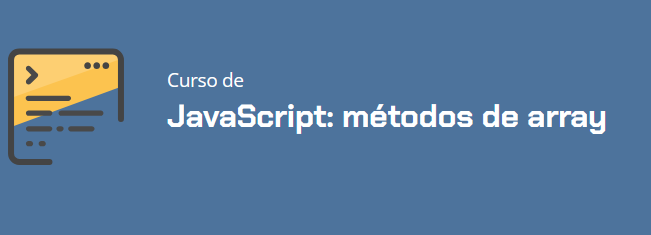
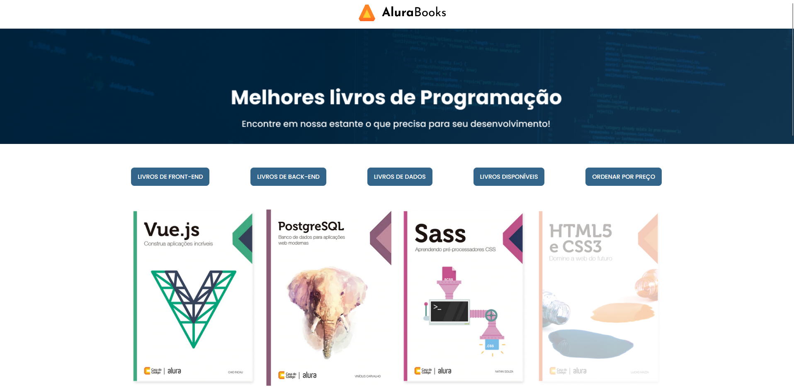

# AluraBooks

Este projeto faz parte do meu aprendizado de JavaScript, no curso da Alura: JavaScript: métodos de array

Neste curso, pude desenvolver um pouco mais do projeto **AluraBooks**, um site de listagem de livros.

## Sobre o projeto

## Funcionalidades do projeto

1. Filtragem de livros por categoria de livros
2. Aplicação de desconto global
3. Aplicação de desconto por categoria de livros
4. Ordenação de livros por preço crescende ou decrescente

## Técnicas e Tecnologias

- `HTML`: criação dos elementos da tela;
- `CSS`: estilização da aplicação;
- `JavaScript`: construção de elementos dinâmicos através da manipulação do DOM.

## Como Abrir e Rodar o Projeto

1. Certifique-se de que você tem um navegador web moderno instalado. Recomendo o uso do Google Chrome ou Mozilla Firefox;
2. Abra a pasta onde o projeto foi baixado ou extraído, você encontrará um arquivo chamado index.html, a raíz do projeto;
3. Ao abrir o arquivo index.html, o projeto será aberto em seu navegador padrão, e você já poderá utilizar a aplicação.

Com isso, o sistema se torna cada vez mais prático e de fácil uso para o cliente que estaria entrando no site da **AluraBooks!**
